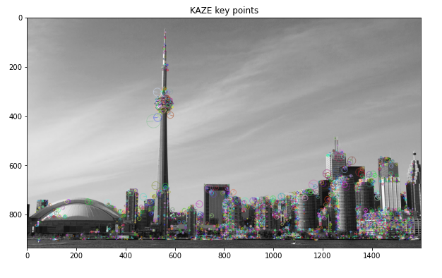
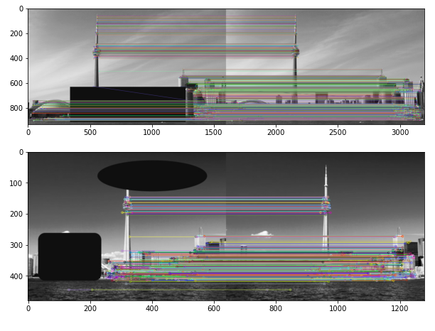

# Kaze Keypoints Notebook 📓 

<b>Compares how similar images are by matching Descriptors and comparing the results</b>

<b>Main concepts covered with the project: </b>
<ul>
<li>Computing KAZE keypoints and feature descriptor</li>
<li>Comparing Multiple Images by their Keypoint Desciptors</li>
<li>Picking out correct pair of images after partially corrupting the images</li>
</ul>

<h3>Example of Keypoints found for an image:</h3>

<h3>Example of Image matching after partial image corruption:</h3>

To see the Notebook open Kaze.ipynb or clone the project and play around

